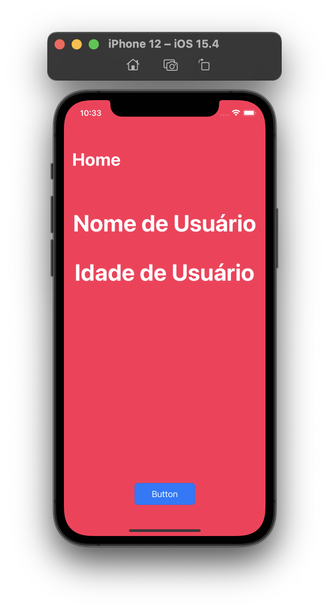
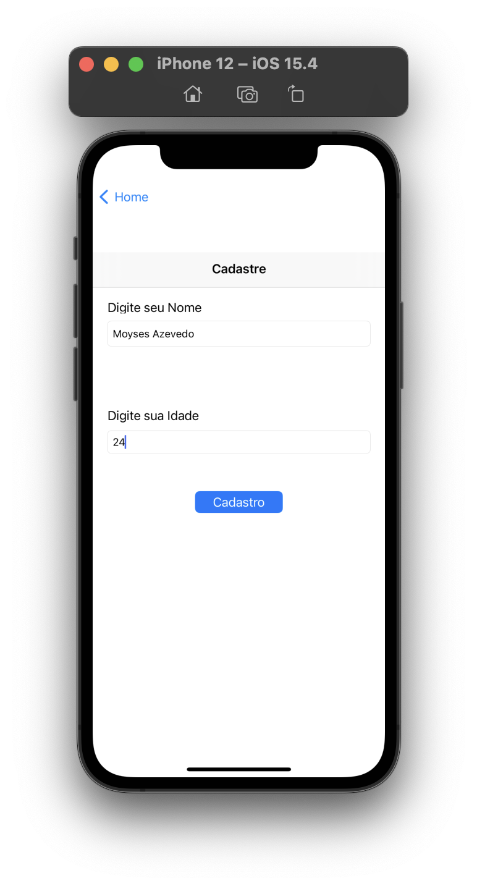
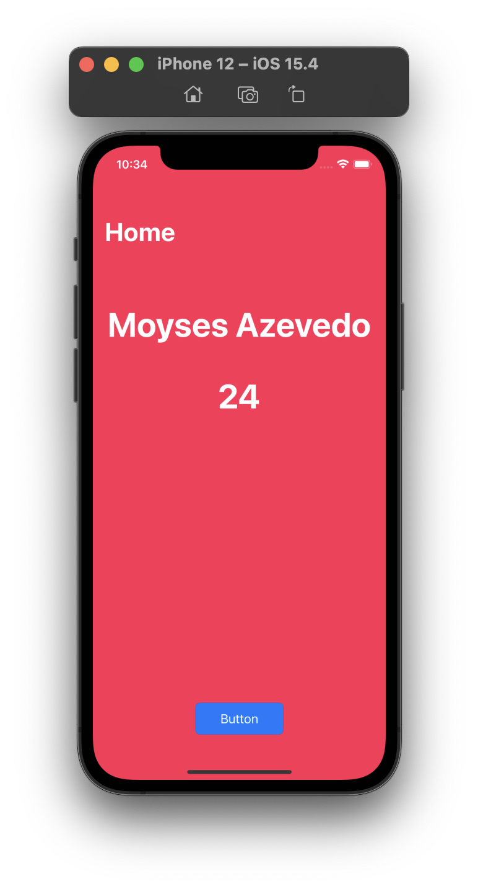

# Delegate

Esse projeto é um modelo simples de passagem de informações entre telas através de um Delegate.


## Resultado:
<div align="center">



</div> 

## Implementação:
### Crie duas classes:

```swift
class ViewController: UIViewController
```

```swift
class CadastreController: UIViewController {
    weak var delegateCadastre: CadastreControllerDelegate?
    //Perceba que uma das classes precisa receber um Tipo do protocolo
```

### Crie um protocolo:

```swift
protocol CadastreControllerDelegate: AnyObject {
    func send(name: String, age: String)
}

```


### Assine o Protocolo:

```swift
extension ViewController: CadastreControllerDelegate {
    func send(name: String, age: String) {
        self.name = name
        self.age = age
    }
```

### Instancie e passe a primeira classe para a variavel delegate. 
 - Parte mais dificil de entender na minha Opnião
 - Obs: ViewController e CadastreController serão chamadas de View1 e View1 respectivamente.

### O que esta acontecendo na última implementação?

```swift
@IBAction func buttonAction(_ sender: Any) {
    let storyboard = UIStoryboard(name: "Cadastre", bundle: nil)
    let secondVC = storyboard.instantiateViewController(identifier:"Cadastre") as! CadastreController
    secondVC.delegateCadastre = self
    self.navigationController?.pushViewController(secondVC, animated: true)
}
```
 
A view1 possue uma função responsável por chamar a view2 (func buttonAction). Logicamente, é necessario uma instancia da view2 e esse é o momento do "pulo do gato". Após a instância, você tem permissão para colocar valores em atributos(propriedades) públicas ou chamadas de funções. Atribua a propriedade delegate o valor self. 

Caso o atributo delegate da view2 fosse do tipo da classe view1 você teria acesso a todas as informações da instancia da view1, ao passar self, o que não é interessante programaticamente.

Pensa comigo. Se você tem acesso a todas as informações de um objeto, isso implica no aumento da possibilidade de implementações erronias. Mas se você tem acesso somente a uma unica função é fácil indentificar caso apareça um erro. E no mundo da programação identificação rápida de problema é dinheiro e menos aspirinas. 


## Apredendizados Adicionais com esse projeto: 

 - Utilizar https://www.toptal.com/developers/gitignore/ para ajudar no .gitignore (Mac e Xcode)
    
 - Sempre subir o arquivo project.pbxproj. Ele é responsável pelas referencias de arquivos e pastas. Caso você adicionar um Arquivo ou Pasta e não upar esse arquivo para o git a organização de Arquivos do seu Xcode ficará diferente.

## License
[MIT](https://choosealicense.com/licenses/mit/)
