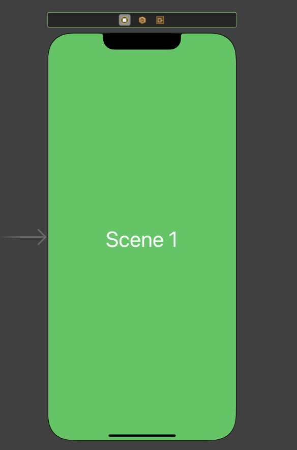

# Navigation

Esse projeto busca mostrar como funciona algumas formas de  navegação entre views usando ViewCode e Storyboard. 

## Problemas de navegação enfrentados ao trabalhar com Storyboard.

 - Quando comecei a trabalhar com Storyboard eu fazia todas as minhas views dentro do mesmo arquivo e criava suas respectivas conexões. Tive muita dúvida de como chamar uma view de uma StoryBoard-B através de uma view de uma StoryBoard-A.

- Quais funções eu deveria utilizar para transitar entre as views.

## Navegue de uma view de um Storyboard-A para outra view de outro Storyboard-B.

 - Você deve começar criando a view controller e sua respectiva View na StoryBoard - B. 
 - Note que a View possue referência a ViewController, chamada de "Class", e possue um "Stoyboard ID"

```swift
class Scene1Controller: UIViewController {
    override func viewDidLoad() {
        super.viewDidLoad()
    }
```

<div align="left">

</div>  


- Após isso você precisa criar duas referências na view que está dentro da Storyboard - B: a primeira é a controller; a segunda é criar um ID.

- Imagem das referencias

## Instanciando a Storyboard

- Comece instanceando o Storyboard através da função UiStoryboard.
-  Crie sua ViewController com o identificador especificado e o inicializa com os dados(características) do storyboard.

```swift
let storyboard = UIStoryboard(name: "Scene1", bundle: nil)
let secondVC = storyboard.instantiateViewController(identifier:"Scene1") as! Scene1Controller
```

## Tipos de navegação e seus respectivos encerramentos
A view da storyboard Main foi criada com um NavigationController e 3 botões. Cada botão chama uma view diferente através de três funções: buttonScene1(), buttonScene1(), buttonScene3().


Agora que temos nossa ViewController instanciada com as caracteristicas da view da nossa Storyboard, existem algumas formas de chamá-la.

#### Encerramentos estão como comentários (Precedidos de //).

### NavigationController?.popViewController
Funciona como uma pilha de Views. Uma sobre a outra.

```swift
@IBAction func buttonScene2(_ sender: Any) {
    let storyboard = UIStoryboard(name: "Scene3", bundle: nil)
    let secondVC = storyboard.instantiateViewController(identifier:"Scene3") as! Scene3Controller
    self.navigationController?.pushViewController(secondVC, animated: true)
//  self.navigationController?.popViewController(animated: true)
}
```

### Present
- Apresenta uma ViewController de forma modal. 
- Um modal não se sobrepoe a outra.
- Um modal se sobrepõe a views chamadas por uma navigationController

```swift
@IBAction func buttonScene1(_ sender: Any) {
    let storyboard = UIStoryboard(name: "Scene1", bundle: nil)
    let secondVC = storyboard.instantiateViewController(identifier:"Scene1") as! Scene1Controller
    self.present(secondVC, animated: true)
//  self.dismiss(animated: true)
}
```

### Show
Seu comportamento é conveniente a existência NavigationController.
- Existindo NavigationController: Ela chama como a NavigationController?.popViewController
- Não existindo Navigation: Ela chama como a Present.

 
```swift
@IBAction func buttonScene3(_ sender: Any) {
    let storyboard = UIStoryboard(name: "Scene2", bundle: nil)
    let secondVC = storyboard.instantiateViewController(identifier:"Scene2") as! Scene2Controller
    self.show(secondVC, sender: true)
//  if self.navigationController != nil {
//      self.navigationController?.popViewController(animated: true)
//  } else {
//      self.dismiss(animated: true)
//  }
}
```


## License
[MIT](https://choosealicense.com/licenses/mit/)
